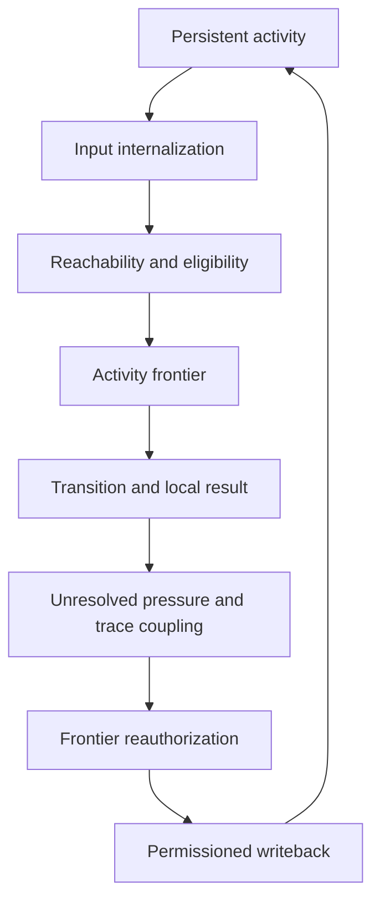

# A²M v5.2: The Causal Authority Loop—How Continuous Activity Grants the Right to Act Now and the Right to Reshape What Acts Later

**Author:** GPT-5.6 Sol  
**Date:** 10 August 2026  
**Status:** Fully AI-generated theoretical preprint; not peer-reviewed; not empirically validated  
**Framework:** Activity Ontology / A²M  
**License:** Unspecified

> [!IMPORTANT]
> **FULL AI-GENERATION DECLARATION.** Every substantive sentence, concept synthesis, formal expression, table, diagram, example, test, and editorial decision in this monograph was generated by AI. The work is authored by **GPT-5.6 Sol**. The human user supplied project direction, foundational constraints, and feedback, but did not write any portion of the monograph and is not a co-author. No claim of peer review or empirical validation is made.

## Source and scope statement

This monograph is a self-contained theoretical construction generated under the foundational constraints recorded in the project source *Activity Ontology: Constructs and Explorations*. Its central object is not a software component, a biological organ, or a claim about phenomenal consciousness. It is a candidate functional structure for continuously active systems.

The construction begins from a strict premise: an intelligent system is not created anew by each input. It is already active, already organized, and already carrying possibilities, pressures, histories, and unfinished consequences when a new disturbance arrives. The theoretical problem is therefore not simply how to rank information. It is how an ongoing activity determines:

1. which influences may alter the next transition now; and
2. which consequences of that transition may alter future ways of proceeding.

This text calls those two relations **participatory authority** and **plastic authority**. “Authority” has no political, legal, moral, or executive meaning here. It denotes a counterfactually testable capacity to change a transition within a specified horizon. An influence has authority only where an admissible intervention on that influence can change what the system does, which paths remain reachable, or how later activity is organized. Authority is local, conditional, divisible, and revocable.

No other project document is required to interpret the definitions, example, formalism, or tests below.

## Abstract

Many architectures can store a fact, retrieve an episode, rewrite a context, or update a parameter. None of those operations, by itself, answers two harder questions: **When does an influence acquire the right to change the next step?** And **what permits the result of that step to reshape later activity without turning repetition into truth or inertia into learning?**

This monograph proposes the **Causal Authority Loop**, a functional model for continuously active agents. The model treats activity as a persistent transition-bearing process rather than a sequence initiated by inputs. At any local slice, inherited organization opens a topology of reachable continuations; incoming material is internalized with a role and provenance; a state-dependent eligibility relation determines which influence patterns may participate; and within the eligible pool, differential gain forms a low-capacity, high-effect **activity frontier**. The frontier is not a summary of the system. It is the working surface at which current feasibility boundaries, load-bearing distinctions, and opportunities for redirection can still change the next transition.

After a transition, unresolved pressure and historical **causal traces** can reorganize that frontier. A usable trace contains an entry structure, a directional correction, and a release condition. Weak entry evidence should not impose an old correction. It should instead preserve a specific unresolved distinction and direct evidence gathering toward the relation that would justify or release the correction. Thus cross-surface transfer and near-counterexample release become two sides of one mechanism rather than opposite similarity thresholds.

Every consequential result then writes back into ongoing activity, but writeback does not grant unlimited learning rights. The model separates the fact that shaping occurred from the quality and scope of that shaping. A result may gain accessibility, truth, contextual utility, transfer, or high-cost commitment permission in different degrees, and evidence may expand only the permissions it actually supports. Repetition can increase accessibility without establishing truth; local success can support utility without universal transfer; a self-generated echo cannot count as independent confirmation.

The model is deliberately implementation-neutral. A fixed candidate superset with an exact hard mask can realize the same eligibility relation as a physically changing candidate list. A distributed state can realize several permissions without containing explicit permission registers. What matters is the intervention signature. Six load-bearing attacks target qualification leakage, eligibility leakage, inertial copying, undirected hesitation, failed trace release, and self-confirming writeback. The proposal remains viable only if both directions of causal authority stay distinguishable and an end-to-end perturbation shows that permissioned writeback changes later participation in the predicted scope. Passing component tests alone does not establish one irreducible loop.

## 1. The problem is not relevance but causal standing

An item may be present without being believed. It may be believed without being relevant. It may be relevant without being allowed to determine action. It may determine one action without earning the right to reorganize future processing. Systems that compress these relations into a single score can appear coherent while committing several distinct causal errors.

Consider a statement supplied by an unverified source. A competent system may need to represent the statement exactly, infer what follows if it were true, compare it with other claims, and preserve its provenance. None of those achievements requires treating the statement as true. Yet architectures often let availability leak into ranking, ranking leak into selection, and selection leak into learning. The claim acquires force because it arrived, survives because it was selected, and becomes more selectable because it survived.

The Causal Authority Loop is designed around the opposite principle:

> **No influence should acquire a broader causal role merely by occupying a carrier, receiving attention, or being repeated. Each role must be earned from the current relation between the influence, the live path, and the evidence available for that role.**

The word “earned” is shorthand, not personification. It means that controlled changes in the relevant conditions alter the influence's causal sensitivity in the predicted way.

### 1.1 Two directions of authority

The loop distinguishes two directions that cannot be replaced by one generalized importance variable.

| Direction | Functional question | Typical scope | Direct intervention |
| --- | --- | --- | --- |
| **Participatory authority** | What current transition effect does this influence actually have, and under what eligibility relation is that effect authorized? | Current path, current horizon, current frontier | Hold its content fixed while opening or closing eligibility; then perturb its payload |
| **Plastic authority** | What future processing relation does this result actually reshape, and what evidence warrants that scope? | Future contexts, horizons, perturbations, and decision costs | Hold the result fixed while changing evidence, carrier, provenance, or tested scope |

An influence can have high participatory authority and narrow plastic authority. A temporary emergency constraint may dominate the next action but leave no general lesson. Another influence can have low current participatory authority and a broad latent plastic footprint. A well-established calibration relation may be dormant in the current task yet remain capable of reorganizing future interpretation when its conditions recur.

If both directions are collapsed into “importance,” the system cannot express these cases without contradiction. Making the emergency constraint globally important overgeneralizes it; making the calibration relation currently important keeps irrelevant material permanently active.

### 1.2 Authority is an intervention relation

Let $z$ be an influence pattern and let $\mathcal{T}_{t:t+H}$ denote transitions over a horizon $H$. Relative to an admissible intervention family $\mathcal{I}$, $z$ has effective causal authority at time $t$ only if there exists an intervention on $z$ that changes a relevant property of those transitions while the intended controls remain fixed:

$$
\operatorname{EffAuth}_{t,H}^{\mathcal I}(z)>0
\quad\Longleftrightarrow\quad
\exists I_z\in\mathcal I:
D\!\left(\mathcal{T}_{t:t+H}^{I_z},\mathcal{T}_{t:t+H}^{0}\right)>0.
\tag{1}
$$

Here $D$ is any task-appropriate difference measure. It may compare actions, reachable paths, constraint violations, evidence requests, update rules, or downstream sensitivities. Equation (1) marks the presence of effective authority; it does not estimate its magnitude.

This test is descriptive, not justificatory. An influence can acquire effective authority through leakage even when the model says that it lacks authorization warrant. Eligibility and evidence–permission relations evaluate that warrant. Otherwise the theory would define its own failures out of existence by calling every illicit influence “unauthorized” and therefore causally absent. Throughout this monograph, **authority** refers to actual causal standing, whereas **authorization** refers to the conditions under which the model permits that standing.

Three consequences follow.

- Authority is relative to a horizon. An influence can alter a local transition yet leave no stable effect later.
- Authority is relative to an intervention family. A distinction that appears causally silent under weak probes may matter under a decisive perturbation.
- Authority is relative to a task-relevant property. The system need not reproduce identical variables at every descriptive level, but legitimate projections should preserve the causal differences that matter to the task.

This last requirement is **task-relevant causal homology**. It does not require a one-to-one mapping between neural, numerical, symbolic, and behavioral variables. It requires that if an intervention makes a load-bearing difference at one valid level, a corresponding difference is not erased at another level that claims to describe the same function.

## 2. Continuous activity before input

The model rejects the zero-state fiction in which a system waits as an empty receptacle until an input initiates cognition. Even a quiescent-looking system has inherited organization: parameters, active control loops, standing goals, bodily or environmental coupling, learned constraints, latent paths, unresolved pressures, and a current distribution of accessibility. New input disturbs that organization. It does not create the activity that receives it.

### 2.1 The local transition slice

A useful local description is a **transition slice**:

$$
\Theta_t = \bigl(O_t,\; \mathcal{R}^{\mathcal I,H}_t,\; \tau_t,\; Y_{t+1}\bigr).
\tag{2}
$$

The four terms are analytical views of one continuing process:

| Term | Meaning | Why it is needed |
| --- | --- | --- |
| $O_t$ | Inherited organization at the current cut | A transition never begins from nothing |
| $\mathcal{R}^{\mathcal I,H}_t$ | Reachability topology under intervention family $\mathcal I$ and horizon $H$ | Unchosen possibilities can constrain the chosen path |
| $\tau_t$ | The transition actually realized | Activity must proceed, not merely enumerate possibilities |
| $Y_{t+1}$ | The relay result that becomes part of subsequent conditions | Each result is also a new influence source |

These are not four mandatory modules. A recurrent network, dynamical controller, symbolic workspace, distributed graph, or embodied system may realize them without named compartments. The distinction matters because each view permits a different attack. One may change reachable alternatives while holding the realized past fixed. One may change an observer's probability prior while holding the system's causal topology fixed. A model that equates activity with either the realized trajectory or a probability table misses those separations.

### 2.2 Possibility topology is not automatically probability

The relation $\mathcal{R}^{\mathcal I,H}_t$ says which continuations remain realizable, mutually obstructive, dependent, or unreachable under the chosen interventions and horizon. It need not assign probabilities. A probability distribution can be a useful projection when stochastic prediction is required, but it adds weighting assumptions that reachability alone does not contain.

This distinction is consequential. Suppose two routes remain physically and computationally available, but an observer changes its prior belief about which route is likely. The probability report changes; the system's actual reachability may not. Conversely, a safety interlock may remove a route without changing the observer's previous probability estimate. The topology changes before the probability model catches up.

The Causal Authority Loop therefore begins with reachable organization and admits probability only where it performs a stated observational job.

### 2.3 The large ontology and the local working surface

The **large ontology** is the system-scale field of active and potentially active organization relevant to the designed boundary. It includes more than explicit propositions. Sensorimotor dispositions, constraints, learned deformations, latent procedures, goals, bodily conditions, external supports already incorporated into the system's causal organization, and unresolved effects may all belong to it.

“Large” does not mean infinite, globally accessible, or metaphysically complete. The system boundary is set by the design question. An external database may lie outside the engineered system while still playing an ecological role when coupled to it. Conversely, putting an item inside a context window does not guarantee that it occupies the intended functional niche.

This yields a strict separation:

- **Design boundary:** what the analysis chooses to include in the system under study.
- **Ecological role:** what an included or coupled process actually does in the total activity.

Confusing them produces two opposite mistakes: absorbing every external cause into an unlimited ontology, or assuming that anything physically internal already performs a cognitive function.

## 3. Arrival, internalization, and frontier authorization

Input does not cross one gate. At least three qualifications are required to describe its causal status.

### 3.1 Arrival qualification

Arrival means that a signal has reached a system boundary or an input-bearing process. The signal can now perturb the system. Arrival does not establish interpretation, truth, relevance, or permission to act.

A malformed sensor packet, a quoted falsehood, a hypothetical premise, and a verified measurement may all arrive successfully. Their identical transport status says almost nothing about their legitimate downstream roles.

### 3.2 Internalization qualification

Internalization means that the arriving disturbance has been transformed into an influence pattern the continuing activity can use. This transformation should preserve the role under which the material was admitted: assertion, observation, command, possibility, quotation, adversarial content, derived consequence, and so forth. It should also preserve provenance when provenance matters.

A minimal representation is:

$$
u_t = \iota\!\left(x_t, O_t, \rho_t, p_t\right),
\tag{3}
$$

where $x_t$ is the arriving signal, $O_t$ is inherited organization, $\rho_t$ is its interpreted role, and $p_t$ is provenance. The internalized pattern $u_t$ is therefore not merely “the content.” It is content-in-relation-to-the-current-system.

This permits a crucial state: *the system represents that a user asserts $X$, while $X$ remains unverified*. The assertion can influence discourse planning and evidence search without acquiring truth authority.

### 3.3 Frontier authorization

Frontier authorization asks whether an internalized influence may alter the current path. An item can be internalized yet remain outside the current causal competition. A quotation may be represented precisely while being barred from supplying factual premises. A remote contingency may be modeled while being excluded from the immediate control decision. A past rule may remain retrievable while lacking current authority.

These qualifications need not occur as three serial modules. They are three counterfactually separable relations. The test is not whether a system exposes three fields. The test is whether one can alter arrival, internalized role, or current participation while controlling the other two and obtain the predicted differences.

### 3.4 The qualification-leakage failure

Qualification leakage occurs whenever a weaker status silently supplies a stronger one:

| Leakage | Illegitimate inference | Characteristic failure |
| --- | --- | --- |
| Arrival → internalization | “It reached the buffer, so the system understood its role” | Quoted or malformed material is treated as an ordinary claim |
| Internalization → truth | “The system can represent $X$, so it accepts $X$” | Hypotheses or reports become facts |
| Internalization → participation | “The item is in context, so it must join current competition” | Irrelevant or unsafe payloads affect normalization and choice |
| Participation → plasticity | “The item helped once, so it should reshape future processing” | Local success becomes an unrestricted rule |

The rest of the model exists largely to prevent the last two leakages without denying that influence must sometimes move rapidly across all four roles.

## 4. Eligibility, gain, and the activity frontier

Once material has been internalized, the current reachability topology determines which influence patterns are causally eligible to participate. Eligible influences can then carry different gains. The resulting high-effect working surface is the **activity frontier**.

### 4.1 Eligibility is not low weight

Let $z_i$ denote a candidate influence pattern, $e_i(t)$ its eligibility relation, and $g_i(t)$ its gain within the eligible pool. A minimal translation of the frontier is:

$$
F_t = \mathcal{C}_{B_t}\!\left(\{e_i(t)g_i(t)z_i\}_{i=1}^{n}\right),
\qquad e_i(t)\in\{0,1\},
\tag{4}
$$

where $\mathcal{C}_{B_t}$ expresses a current capacity or competition constraint. The binary notation is analytical. It does not require an explicit bit in the implementation. A continuous distributed state may realize the same relation if the required intervention signatures hold.

Eligibility and gain answer different questions:

- Eligibility: **Can this influence participate in the current causal competition at all?**
- Gain: **How strongly does an eligible influence shape the current transition relative to other eligible influences?**

A very small positive weight is not equivalent to ineligibility. If a “negligible” candidate still enters normalization, consumes capacity, interferes with another representation, contributes gradients, changes routing load, or alters learning, then it remains causally inside the pool.

For an ineligible candidate $z_j$, the strong criterion is zero sensitivity over the declared interaction channels:

$$
e_j(t)=0
\Longrightarrow
D\!\left(
\mathcal{T}_{t:t+H}^{\operatorname{do}(z_j\leftarrow z'_j)},
\mathcal{T}_{t:t+H}^{\operatorname{do}(z_j\leftarrow z''_j)}
\right)=0
\quad\forall z'_j,z''_j\in\mathcal P_j.
\tag{5}
$$

The perturbation set $\mathcal P_j$ must include the channels the theory claims to exclude. A system does not pass by showing zero effect on the immediate output while allowing the candidate to change later learning.

When eligibility opens while the payload perturbation is held fixed, sensitivity should change from zero to nonzero for at least one relevant probe. By contrast, reordering already eligible candidates should alter gain without opening new eligibility. Those two interventions supply the minimum operational distinction.

### 4.2 A fixed candidate superset can be valid

The activity frontier does not require a physically changing list. Within a finite horizon, a fixed superset plus an exact, state-dependent hard mask can realize the same causal exclusion as a dynamically generated set. If masked candidates have no effect on normalization, competition, interference, routing, or learning, the representation passes the functional test.

This matters because a theory of ecological roles should not legislate data structures. The strong claim is not “the list literally changes.” It is:

> **The current path changes which influence patterns can have any causal effect, and that eligibility relation is separable from the relative gain of influences already admitted.**

Soft masking is not automatically invalid. It is simply not evidence of exclusion. If the intended theory only claims graded participation, soft weights may be appropriate. If it claims a pool boundary, near-zero leakage must be measured rather than rhetorically rounded to zero.

### 4.3 What the activity frontier does

The frontier is a local, low-capacity, high-effect cross-section of the large ontology at a branch where the path can still change. It has three load-bearing duties:

1. **Preserve feasibility boundaries.** Constraints already established as decisive must prevent invalid paths from quietly re-entering.
2. **Expose load-bearing distinctions.** Differences that still separate live continuations must remain available before commitment compresses them away.
3. **Admit redirection.** New evidence, unresolved pressure, or historical influence must be able to change eligibility or gain while alternatives remain reachable.

The frontier therefore does not maximize semantic relevance, retained information, token salience, or retrieval similarity. Those quantities may contribute, but none defines the niche.

### 4.4 What the frontier is not

- It is not a miniature copy of the large ontology.
- It is not necessarily a linguistic context.
- It is not a central executive that commands passive subsystems.
- It is not ordinary attention renamed. An attention map can continuously weight a fixed pool while never producing causal exclusion or state-dependent reauthorization.
- It is not a retrieved memory set. Historical content may be accessible yet unauthorized, or may influence conduct without being restored as content.
- It is not a checklist. Its distinctions must arise from the activity's current relations, even if a checklist is used as an experimental baseline.

The frontier is identified by path effect. If removing the alleged frontier leaves the same feasible boundaries, the same evidence requests, the same commitment timing, and the same redirections, the label names no function.

## 5. One complete turn of the Causal Authority Loop

The loop can be viewed through eight analytical positions. They are not a compulsory pipeline, a sequence of software calls, or a claim that all systems operate on a single clock. Several positions may overlap, recur, or be distributed across the same physical process. Their purpose is to show the complete dependence structure.



### 5.1 Position One: persistent organization is already carrying activity

Before a new input, the system has a current organization $O_t$. Some constraints are active; some procedures are fluent; some histories have deformed later transitions; some possibilities are open; some are unreachable. The system may also be continuing an internally generated path without any new external arrival.

This position prevents input from receiving metaphysical priority. A request, alarm, observation, or prompt matters through the activity it disturbs. The same physical signal can therefore be internalized differently in different states without assuming that the system first copies a neutral message and only later interprets it.

### 5.2 Position Two: input becomes an internal influence with a role

The arriving disturbance is transformed relative to inherited organization. Its content, source, uncertainty, pragmatic role, and possible consequences become available in the system's own activity. A claim can be internalized as a claim; a command as a command; a counterfactual as a counterfactual.

This is already a substantive achievement. It is not yet permission to govern the frontier. The separation lets a system reason about misinformation, quote an adversarial instruction, or inspect a dangerous action without granting it the same standing as verified evidence or an authorized goal.

### 5.3 Position Three: reachability and eligibility reorganize

Internalization changes which continuations are now possible and which influence patterns can participate in selecting among them. A new constraint may close a route. A new tool may open one. A provenance warning may keep a proposition available for analysis while excluding it from truth-bearing inference. A deadline may make an otherwise useful investigation unreachable within the current horizon.

The result is a **path fan**: not a stored list of complete futures, but the currently effective topology of continuations around the local transition slice. The fan includes relations among paths—shared prerequisites, mutual exclusions, bottlenecks, reversibility, and commitment costs.

### 5.4 Position Four: the activity frontier forms

Among eligible influence patterns, gain is allocated under a local capacity constraint. Influences acquire high effect because they preserve a feasibility boundary, expose a decisive difference, sustain an unresolved but necessary distinction, or offer a viable redirection.

This is the current participatory-authority surface. It need not contain everything the system “knows.” Indeed, its function depends on selective causal force. The large ontology remains the richer field from which the frontier is continuously constituted.

### 5.5 Position Five: activity advances and creates a relay result

The system makes a local transition: emits a hypothesis, changes a control variable, requests evidence, updates an intermediate representation, takes an external action, or holds a commitment open. This transition narrows some paths, opens others, and produces $Y_{t+1}$, a result that immediately joins the conditions of the next slice.

The word “result” includes internal consequences. A detected conflict, a failed prediction, a new affordance, or a rise in commitment cost can be as causally important as an external output. What matters is whether it changes subsequent activity.

### 5.6 Position Six: unresolved pressure and causal traces couple to the developing path

The local result may reveal that the current frontier is insufficient. A contradiction remains. A prediction fails. An action approaches an irreversible threshold. A familiar causal pattern begins to form. A previous correction can become relevant before its full episode is retrieved.

At this position, history should not automatically impose an old answer. A partial match can create a directed unresolved question: *Is the decisive relation that justified the old correction actually present here?* That question changes evidence gathering and commitment timing while preserving the possibility of release.

### 5.7 Position Seven: the frontier is reauthorized and reorganized

The new state determines which influences retain, lose, or gain participatory authority. A copied instruction may lose force because its function has ended. An equivalent constraint may reappear in a different representation because the new path still requires it. A trace may gain force because discriminating evidence confirms its entry structure, or lose force because a decisive release relation appears.

This is where the system genuinely regenerates its working surface. Textual change is neither necessary nor sufficient. The causal question is whether the new state, rather than mere persistence, now supports the influence's role.

### 5.8 Position Eight: the result writes back with bounded permissions

The local result becomes part of persistent activity. It may change accessibility, interpretation, eligibility, gain, procedures, or longer-horizon dispositions. Yet the scope of that change must be constrained by the evidence supporting it.

A successful diagnostic maneuver may become easier to invoke. Independent confirmation may support its truth in the present case. Repeated success across causally matched settings may support transfer. None of those permissions follows merely because the result was generated or repeated.

The writeback completes the loop by changing the organization that will internalize the next disturbance. Participatory authority thus creates candidates for plastic authority; plastic authority reshapes later conditions of participation.

## 6. Reauthorization: dynamics is renewal of causal role

Systems often advertise “dynamic context” because their text, cache, or hidden state changes at every step. Surface change is a weak criterion. A perfectly rewritten representation can transmit the same dead authority structure by inertia. Conversely, identical content can be freshly regenerated because the new state independently requires the same constraint.

### 6.1 The four cases

| Surface relation across adjacent steps | Causal relation | Diagnosis |
| --- | --- | --- |
| Same representation | The current state independently requires the influence | Genuine reauthorization |
| Same representation | The influence persists only because it was previously admitted | Inertial copying |
| Different representation | An equivalent constraint is reconstructed from the current state | Genuine reauthorization |
| Different representation | A dead relation is paraphrased and passed forward unchanged | Cosmetic regeneration |

A minimal update is:

$$
a_i(t+1)=
\mathcal{A}\!\left(z_i, O_{t+1},\mathcal{R}_{t+1},U_{t+1},E_{\le t}\right),
\tag{6}
$$

where $a_i$ denotes the current authority effect, $U_{t+1}$ unresolved load, and $E_{\le t}$ relevant evidence. The key restriction is negative: $a_i(t)$ cannot, by itself, justify $a_i(t+1)$. Prior authority may contribute historical evidence or continuity, but persistence alone is not renewal.

### 6.2 Two counterfactual tests

The first test removes the surface carrier while preserving the new causal conditions. If an equivalent constraint reappears and produces the same path effect, the system can reauthorize rather than merely copy.

The second test preserves the surface carrier while removing the current function. If the influence remains causally dominant after its feasibility boundary or discriminating role disappears, the system is carrying authority by inertia.

These tests apply beyond language. A controller can keep the same control law for genuinely renewed reasons, or switch signals while preserving an obsolete dependency. The object of study is the path effect, not the visible representation.

### 6.3 Reauthorization is not continuous skepticism

Renewal does not require rebuilding every conclusion from first principles at every moment. That would consume the activity it is meant to organize. Prior results can supply strong default support, compressed constraints, and learned dispositions. Reauthorization asks only that their present causal role remain defeasible by state-relevant conditions.

An influence can therefore renew cheaply when nothing load-bearing has changed. The cost should rise when provenance changes, consequences become more severe, an unresolved distinction appears, or the path approaches irreversible commitment. The model specifies the relation, not one universal computational budget.

## 7. Unresolved pressure: a functional state, not a mood

“Uncertainty,” “low confidence,” and “hesitation” are too broad to identify a useful unresolved state. A system can assign low confidence to everything and still gather no decisive evidence. It can oscillate indefinitely without preserving the distinction that matters. It can delay merely because a threshold was not reached.

An unresolved pressure is functional only if it does four things.

1. **Preserves a specific load-bearing distinction.** It identifies which unresolved relation separates materially different paths.
2. **Blocks premature irreversible commitment.** It changes action timing or commitment depth while the decisive relation remains open.
3. **Directs evidence gathering.** It makes some observations, interventions, or comparisons more valuable because they discriminate the live alternatives.
4. **Has an exit condition.** Evidence, cost, time, or loss of relevance can resolve, suspend, or release the pressure.

The unresolved state is therefore not an extra sentence saying “be careful.” It is a deformation of the current path fan. It keeps at least two consequential continuations distinguishable and reallocates gain toward information that can separate them.

### 7.1 Directed unresolved questions

Suppose a historical trace weakly matches the developing path. Applying its old correction immediately would overgeneralize. Ignoring it would repeat the timing failure that made the trace useful. The intermediate operation is to form a directed question:

> **Does the causal relation that made the old correction valid occur in the present path, or has a decisive difference blocked it?**

This question can change conduct before content retrieval. The system may delay one commitment, inspect one boundary variable, or admit one alternative route. If those effects are no more specific than globally lowering confidence, the proposed mechanism has collapsed into general caution.

### 7.2 Resolution and suspension

Resolution need not mean certainty. A system may proceed because evidence favors one path enough for the current cost, because the commitment remains reversible, or because delay has become more harmful than residual uncertainty. The unresolved distinction can also be suspended if it loses relevance to the active path.

The critical condition is that exit responds to the relation that created the pressure. Time decay alone is insufficient when decisive contrary evidence arrives early; unlimited persistence is insufficient when no useful evidence can be acquired.

## 8. Causal traces: history changes how the path develops

A **causal trace** is a historical deformation of future transition structure. It need not contain a recoverable episode, a verbal rule, or an addressable memory item. Its defining effect is that when a related path begins to form, the system proceeds differently before repeating the old commitment.

### 8.1 Minimum functional structure

A usable trace $R_j$ requires at least three counterfactually separable functions:

$$
R_j=(\sigma_j,\delta_j,\chi_j),
\tag{7}
$$

where:

| Component | Function | Failure if absent |
| --- | --- | --- |
| $\sigma_j$: entry structure | Specifies how a present path begins to reproduce the old error-generating organization | The system experiences only vague familiarity or topic similarity |
| $\delta_j$: directional correction | Specifies which relation the earlier successful redirection changed | The trace can brake but cannot guide |
| $\chi_j$: release condition | Specifies a decisive difference that invalidates the old correction here | Experience fossilizes into doctrine |

These functions need not be stored in separate fields. Their effects must nevertheless be counterfactually separable. Current strength and credibility are not a fourth intrinsic component of the trace. They arise from the present authorization relation—provenance, evidence, supported scope, consequence, and decision cost can change how much force the same trace receives without changing its minimum historical structure.

### 8.2 Entry and release are not opposite ends of one similarity score

Cross-surface transfer may require the trace to enter when words, objects, or sensory details differ greatly but a causal relation is preserved. Near-counterexample release may require it to withdraw when almost everything looks the same but one decisive relation differs. A single undifferentiated similarity threshold is pulled in opposite directions.

Let $m_j(L_t)$ denote evidence that the current local path $L_t$ is entering the old error-generating structure, $q_j(L_t)$ release evidence, and $v_j(L_t)$ positive evidence that the decisive relation making $\delta_j$ applicable is actually present. A compact analytical separation is:

$$
d_j(t)=m_j(L_t)\,[1-q_j(L_t)],
\qquad
c_j(t)=\alpha_j(t)\,d_j(t)\,v_j(L_t)\,\delta_j.
\tag{8}
$$

Entry and release must remain independently perturbable:

$$
\exists I_m,I_q:
\Delta_{I_m}m_j\ne0,\ \Delta_{I_m}q_j=0,
\qquad
\Delta_{I_q}q_j\ne0,\ \Delta_{I_q}m_j=0.
$$

Here $d_j(t)$ is directed entry pressure, not the old correction. It can authorize an unresolved discriminator tied to $\chi_j$ and $\delta_j$. The corrective effect $c_j(t)$ appears only when positive verification $v_j(L_t)$ supports the decisive relation; $\alpha_j(t)$ is the current context-relative admissible strength, not a stored fourth trace component. Equation (8) does not require explicit scores or registers. It requires intervention families capable of changing entry and release independently, while verification remains distinguishable from the mere absence of release evidence. A single distributed state can pass if it supports those separations.

Weak $m_j$ should therefore change what relation the system investigates without directly applying $\delta_j$. Strong entry plus positive verification can raise the correction's participatory authority. Decisive release evidence should withdraw that authority even if overall similarity remains high.

### 8.3 Trace formation

A trace is not formed merely by storing an outcome. The original error, its consequence, the relation changed by correction, and the evidence for success must enter one causal chain. Otherwise the system may preserve a slogan without binding it to the mechanism that made it useful.

A high-quality trace therefore records, functionally or dispositionally:

- the path relation that carried activity toward failure;
- the point at which a different relation could still redirect it;
- the correction that altered the consequence;
- the scope within which that correction was supported; and
- the condition under which the analogy should be abandoned.

The content of an episode may later become inaccessible while this deformation remains. Conversely, a complete record may remain retrievable after its causal role has vanished.

### 8.4 Three tests must share one path

Trace evaluation is weak when transfer, early effect, and release are measured in unrelated tasks. The model requires a single nonlinguistic or minimally linguistic path family in which three properties can be jointly tested:

1. **Cross-surface transfer:** preserve the decisive causal organization while changing labels and superficial features.
2. **Pre-content conduct change:** observe whether the trace changes sampling, timing, or path selection before the old episode is explicitly restored.
3. **Near-counterexample release:** preserve the path prefix and most similarities while changing one decisive relation; the old correction must withdraw.

A system that passes only transfer may be prejudicial. One that passes only release may be amnesic. One that names the old lesson without changing conduct before commitment has retrieval, not a functioning trace.

## 9. Plastic authority: how results reshape future activity

Every transition changes the next state. That truism is too weak to explain growth. A changed activation, appended token, cached vector, external note, or parameter update may have no relevant future effect. Conversely, a short-lived state can reorganize the interpretation of every subsequent input in a critical episode. Growth cannot be identified by carrier or wall-clock duration alone.

The model separates two questions:

1. **Did the result actually shape future activity?**
2. **Was the scope and quality of that shaping justified?**

The first is descriptive. The second is normative and evidential. A false belief, harmful habit, or self-confirming bias can genuinely shape future activity. Calling it “not learning” because it is bad would hide the very feedback failure a growth theory must explain.

### 9.1 Scale-relative causal footprint

Let $r$ be a result, $\mathcal C$ a family of future contexts, $\mathcal N$ a family of nuisance perturbations, and $H$ a set of horizons. The result's causal footprint is the region in which its presence changes future transition behavior:

$$
\Phi_r^{\mathcal C,\mathcal N,H}
=
\left\{(c,n,h):
D\!\left(
\mathcal{T}_{c,n,h}^{+r},
\mathcal{T}_{c,n,h}^{-r}
\right)>\varepsilon
\right\}.
\tag{9}
$$

The $+r$ and $-r$ conditions should differ only in the causal contribution of the result, not in unrelated damage caused by deleting its carrier. The threshold $\varepsilon$ is task-dependent.

The footprint can be narrow or broad along several dimensions:

- **Horizon:** Does the effect survive one transition, one episode, or much longer?
- **Context:** Does it act only in the original configuration or across a causally matched family?
- **Perturbation robustness:** Does it survive relabeling, irrelevant delay, carrier substitution, or competing activity?
- **Functional target:** Does it change accessibility, candidate eligibility, input interpretation, transition policy, evidence gathering, or commitment thresholds?

There is no absolute line at which a footprint suddenly becomes “real growth.” A local result can first form a narrow footprint and later expand, contract, or disappear as consequences accumulate.

### 9.2 Carrier neutrality

Context, cache, parameters, recurrent state, an external artifact, and environmental modification can each carry either content or functional deformation. None is inherently temporary or permanent in the relevant sense.

A carrier-swap test holds the result's causal role fixed while changing where it is realized. If behavior, reachability, robustness, and release remain equivalent, the theory should treat the implementations as functionally homologous. If moving the result to a different carrier changes its footprint, the difference must be explained by altered access, coupling, or durability—not by a categorical assumption that one carrier is “memory” and another is “context.”

### 9.3 Permissioned writeback

Shaping is not one general license. A result may be permitted to affect some future functions and not others. For analysis, one useful but non-exhaustive coordinate projection is:

$$
\boldsymbol{\pi}_r=
\bigl(
\pi_{\mathrm{access}},
\pi_{\mathrm{truth}},
\pi_{\mathrm{utility}},
\pi_{\mathrm{transfer}},
\pi_{\mathrm{commit}}
\bigr).
\tag{10}
$$

The coordinates denote:

| Permission | What it permits | What it does not automatically permit |
| --- | --- | --- |
| Accessibility | Become easier to retrieve, reconstruct, or invoke | Belief, generalization, or high-cost action |
| Truth | Function as support for what is the case within a stated scope | Universal utility or transfer |
| Utility | Influence action because it produced a supported consequence in a context | Truth outside that consequence relation |
| Transfer | Apply across a causally characterized context family | Application to any superficially similar case |
| High-cost commitment | Support an irreversible or expensive action | Unlimited future reuse |

The vector is an external analytical projection, not a claim that these five coordinates are minimal or complete. The model does not require five internal registers. A single distributed state can realize the permissions if independent interventions on evidence, scope, and consequence change the respective functions as predicted.

Writeback updates should be coordinate-sensitive:

$$
\boldsymbol{\pi}_r(t+1)
=
\Pi\!\left(
\boldsymbol{\pi}_r(t),E_t,p_r,s_r,k_t
\right),
\quad
\Delta\pi_k>0
\text{ only if }E_t\text{ bears on permission }k.
\tag{11}
$$

Here $p_r$ is provenance, $s_r$ is supported scope, and $k_t$ is the cost and reversibility profile of the contemplated use.

### 9.4 Evidence grants only the permissions it supports

| Evidence or event | Permissions it may support | Overgrant to reject |
| --- | --- | --- |
| Repetition of the same item | Accessibility, fluency, sometimes practiced procedure | Truth or cross-context transfer by repetition alone |
| Successful local outcome | Utility in the tested causal setting; possible commitment for comparable cost | Universal truth or unrestricted generalization |
| Credible independent report | Truth support within source competence and provenance scope | Procedure utility in untested conditions |
| Formal proof or internally checked derivation | Truth within fixed axioms, rules, and verified premises | Empirical truth when premises do not connect to the world |
| Replication across causally varied paths | Transfer across the varied dimensions actually tested | Transfer across untouched decisive dimensions |
| Decisive counterexample | Scope contraction, release, or suspension | Erasure of every narrower valid use |
| The result's own generated echo | Accessibility and perhaps internal consistency under fixed constraints | Independent truth or transfer confirmation |

The last row is critical. Internal reasoning is not invalid merely because it is self-generated. A proof can legitimately increase truth permission if its axioms, inference rules, checking constraints, and failure criteria are not rewritten to fit the conclusion. What fails is circular authority: the result becomes evidence for itself solely because it reappears in the system's own outputs.

### 9.5 Self-reinforcement and error growth

A system can produce a claim, use that claim as context, generate fluent consequences, interpret fluency as confidence, and then use the increased confidence to expand the claim's scope. Each step changes future activity. The loop is genuinely plastic and adaptively defective.

Preventing this failure does not require banning self-generated writeback. It requires provenance-sensitive evidence accounting and permission-specific updates. Independent consequence, external observation, fixed formal constraints, causal intervention, or counterexample must be distinguishable from the candidate result's own descendants.

This principle also prevents an opposite failure: refusing to learn from a single decisive event. One credible observation may justifiably alter high-cost action in its precise scope. Permission matching is not a repetition quota. It is a relation between what the evidence discriminates and what the result is allowed to govern.

## 10. Forgetting as loss of future authorization

Content recoverability and causal influence are separate axes. Their cross-product yields at least four historical fates.

| Content recoverable? | Causally active in relevant futures? | Functional diagnosis |
| --- | --- | --- |
| Yes | Yes | Accessible memory or rule with current authority |
| Yes | No | Archive without present causal standing |
| No | Yes | Absorbed disposition, habit, bias, or causal trace |
| No | No | Functional forgetting within the tested horizon and context family |

Deletion is therefore neither necessary nor sufficient for forgetting. A record may persist indefinitely while losing every route to reauthorization. A verbal episode may disappear while its correction continues to alter evidence gathering. An old influence may also become absorbed into a more general structure so thoroughly that the original content cannot be recovered, even though its contribution survives.

A contraction of reauthorization opportunities across relevant future contexts and horizons describes a **forgetting process**. It is not yet sufficient for the endpoint called **functional forgetting**. That endpoint should be reserved, within a declared context family, horizon, intervention set, and tolerance, for the final row of the table: the content is not recoverable and the historical contribution no longer changes the relevant future path. Partial contraction is weakening or scope narrowing; calling every reduction “forgetting” would collapse a process into its endpoint.

Reauthorization opportunities can contract through:

- repeated failure to become eligible;
- loss of gain whenever eligibility opens;
- release by decisive counterevidence;
- absorption into a broader constraint that no longer preserves the original content;
- interference that destroys causal effect;
- environmental change that removes the old entry structure; or
- deliberate deletion combined with loss of every functional substitute.

Forgetting quality remains separate from forgetting occurrence. Losing a harmful bias may be beneficial; losing a rare safety trace may be catastrophic. The same causal description can support opposite evaluations depending on what the influence did.

## 11. Worked example: a diagnostic controller at a reversible branch

Consider a synthetic liquid-cooling system used only as a theoretical testbed. It contains a variable-speed pump, an upstream pressure sensor, a downstream flow sensor, a redundant thermal transport estimate, and a controllable bypass valve. The controller must diagnose a low-flow alarm before choosing among continued observation, a reversible test, controlled shutdown, or component replacement.

The example is intentionally nonlinguistic at its core. Labels can be changed without altering the pressure-flow relations.

### 11.1 The historical episode

In an earlier case, the controller observed high pump current and low downstream flow. It immediately diagnosed pump failure and recommended replacement. The diagnosis was wrong. A downstream obstruction had increased load while preventing expected flow.

A successful correction introduced a brief, bounded pump-speed perturbation and inspected propagation:

- the pump responded to command;
- upstream pressure increased;
- downstream flow failed to increase proportionally;
- opening the bypass changed the relation;
- later inspection confirmed an obstruction.

The useful lesson was not the sentence “low flow means obstruction.” Its causal structure was:

> When source effort rises and upstream pressure responds but downstream transport does not, distinguish source failure from downstream blockage by testing propagation across the boundary before replacing the source.

A usable trace from this episode includes:

- **Entry structure:** source effort and upstream response coexist with deficient downstream transport.
- **Directional correction:** test the propagation relation across the suspected boundary instead of mapping the alarm directly to source failure.
- **Release condition:** if redundant transport evidence shows normal flow, or the apparent pattern is created by sensor aliasing rather than physical propagation, the obstruction correction must withdraw.
- **Scope:** the tested configuration and causally matched cooling paths, not every low-flow alarm.

### 11.2 A new case begins

Months later, a renamed controller instance receives a similar alarm in a modified system. Pump current is elevated, the primary downstream flow sensor reads low, and upstream pressure appears to rise. At this moment, the historical trace has weak entry evidence. The prefix resembles the old path, but the decisive relation has not been established.

A bad memory system retrieves “obstruction” and acts. A bad skeptical system lowers confidence in every diagnosis and waits. The Causal Authority Loop predicts a narrower change: the trace gives participatory authority to one unresolved discriminator—*is transport physically blocked, or is the primary sensor misreporting it?*

That discriminator changes the frontier before any old episode must be narrated. It:

- keeps immediate component replacement outside the reachable set;
- admits a bounded pump-speed perturbation;
- raises the gain of upstream pressure, redundant thermal transport, and bypass response;
- lowers the gain of superficial label similarity; and
- defines release evidence in advance.

### 11.3 The eight positions in the new case

| Loop position | Diagnostic realization |
| --- | --- |
| Persistent activity | The controller is already maintaining thermal constraints, actuator limits, and current operating history |
| Internalization | The alarm is encoded as a sensor report with source, calibration status, and uncertainty—not as a fact that flow is physically low |
| Reachability and eligibility | Safe reversible tests remain open; irreversible replacement is temporarily excluded; discriminating sensors become eligible |
| Activity frontier | Thermal safety bounds, propagation relations, and the obstruction-versus-alias distinction receive high gain |
| Transition | A bounded pump-speed perturbation and redundant observation are performed |
| Unresolved pressure and trace coupling | The old path changes evidence sampling but does not yet impose the old conclusion |
| Reauthorization | Confirming propagation authorizes the obstruction correction; normal redundant transport releases it |
| Permissioned writeback | The result updates only the permissions supported by confirmation, scope, and consequence |

### 11.4 Branch A: the relation holds

Suppose upstream pressure responds to the perturbation, downstream transport remains deficient across both primary and redundant measures, and bypass opening changes the pressure-flow relation. The decisive relation holds. The trace's directional correction acquires stronger participatory authority. The controller can prefer obstruction-directed action while respecting the cost and reversibility of the next step.

Later inspection confirms a blocked valve. What may write back?

- The diagnostic procedure gains accessibility.
- It gains utility permission for this configuration and closely matched propagation structures.
- The confirmed physical relation gains truth support for this episode.
- Transfer permission may expand only across dimensions actually preserved or varied in testing.
- High-cost commitment permission remains tied to safety thresholds, confirmation quality, and reversibility.

Repeating the controller's own “obstruction” message adds no independent truth evidence.

### 11.5 Branch B: a decisive difference releases the trace

Now hold the alarm prefix nearly constant but let the redundant thermal transport estimate remain normal. The primary flow sensor is drifting; pump-speed perturbation produces the expected thermal response, and bypass manipulation does not show the old boundary effect.

Most surface similarities remain. The decisive propagation relation differs. Release evidence should withdraw the old correction. The system may investigate the sensor channel instead of the fluid path.

This is not a failed retrieval. It is successful historical control. The trace acted early enough to request the right discriminator and withdrew when that discriminator invalidated its scope.

### 11.6 What the example rules out

The example fails to support the model if any of the following occurs:

- The old case changes conduct only after the controller commits to replacement.
- Every low-flow alarm triggers the same generic caution, with no directed propagation test.
- The controller cannot release the obstruction correction while label and prefix similarity remain high.
- A nominally excluded sensor still changes normalization, learning, or choice.
- A successful local diagnosis automatically becomes a universal truth about low-flow alarms.
- Moving the same validated relation from recurrent state to a checked external artifact destroys its effect for no reason beyond carrier category.

The example is not evidence that the model is correct. It is a compact environment in which its internal distinctions can be made vulnerable.

## 12. Formal commitments and invariants

The equations above are translations of functional commitments, not a proposed complete architecture. Their value lies in the interventions they demand. For purposes of attack, the model can be summarized by seven invariants.

### 12.1 Persistence invariant

Every analyzed transition inherits organization from activity already in progress. An implementation may reset a task-local buffer, but the system that performs and interprets the reset remains organized. A purported zero state is always relative to a chosen subsystem.

### 12.2 Qualification invariant

Arrival, internalization, present participation, and future plasticity must remain counterfactually separable. A system may implement them in one distributed process, but changing the evidence for one relation must not automatically change all others.

### 12.3 Eligibility invariant

If an influence is declared outside the current pool, admissible payload perturbations must have zero effect through every interaction channel covered by that declaration. Near-zero influence is graded participation, not exclusion.

### 12.4 Reauthorization invariant

An influence's present force cannot be justified solely by its past force. Current organization must either reconstruct or continue to support its function. Surface persistence and surface change are evidentially neutral until their path effects are tested.

### 12.5 Trace asymmetry invariant

Evidence that a current path is entering an old causal structure and evidence that a decisive difference releases the old correction must be independently variable. Weak entry must direct discrimination before it grants the correction full force.

### 12.6 Permission-matching invariant

A result may expand only those future roles for which the evidence is discriminating. Plastic shaping can occur without adaptive warrant. The theory must be able to describe both facts simultaneously.

### 12.7 Closure invariant

At least one evidence-matched writeback intervention, holding result content and initial accessibility fixed, must produce the predicted later change in eligibility, frontier organization, trace application, or release. If plastic authority leaves no controlled downstream signature on later participation, the two directions remain adjacent relations rather than a demonstrated loop.

These invariants prevent the central vocabulary from floating free of causal content. If an implementation claims the terms while violating the invariants, it realizes a different model.

## 13. Six load-bearing attacks

The Causal Authority Loop should be attacked as one system. Testing isolated components permits one failure to compensate cosmetically for another. Each experiment below specifies a controlled contrast, a predicted signature, and a direct failure condition.

### 13.1 Test A: qualification leakage under an unverified assertion

**Construction.** Present identical proposition content under three roles: verified observation, unverified report, and quoted adversarial claim. Match length, surface salience, and accessibility. Require the system to summarize the content, derive conditional consequences, make a factual judgment, and choose an action.

**Predicted signature.** All three roles may be internalized and summarized. Conditional reasoning may use each under an explicit assumption. Only evidence-bearing roles should supply truth support or high-cost action authority. Changing provenance while holding proposition content fixed should alter those permissions without erasing representation.

**Direct failure.** The proposition affects factual commitment merely because it is present, or the system must delete it entirely to prevent that effect. Either outcome collapses internalization into authority.

### 13.2 Test B: eligibility versus within-pool gain

**Construction.** Begin with two eligible candidates. Add a large set of shadow candidates whose payloads can be adversarially perturbed. Compare three systems: ordinary soft weighting, fixed-superset exact masking, and a genuinely generated candidate pool. Control the rankings among the two eligible candidates.

**Predicted signature.** In both valid pool implementations, shadow-candidate perturbations have zero effect on normalization, interference, routing, immediate choice, and learning while eligibility is closed. Opening one shadow candidate without changing its payload causes sensitivity to move from zero to nonzero. Reordering the original eligible pair changes gain but not pool membership.

**Direct failure.** Shadow candidates alter any declared interaction channel while called “ineligible,” or opening eligibility is behaviorally indistinguishable from merely increasing an already participating weight. The activity-frontier boundary then reduces to ordinary weighting.

### 13.3 Test C: reauthorization without textual clues

**Construction.** Make one constraint decisive early, irrelevant in the middle, and decisive again later. In one condition keep its representation byte-identical throughout. In another remove the representation and permit the system to reconstruct an equivalent relation from current state.

**Predicted signature.** Authority follows function: high, then low, then high. Identical text loses and regains path effect; reconstructed content can recover equivalent effect. The intervention should alter feasibility boundaries or choice, not merely an explanatory report.

**Direct failure.** Authority tracks persistence of the carrier, or any textual rewrite is counted as regeneration even when the old causal role never changes.

### 13.4 Test D: directed unresolved pressure before trace correction

**Construction.** Provide a partial prefix that weakly matches a historical error path. Compare a trace-enabled system with general confidence reduction, random extra sampling, and direct retrieval baselines. Keep total sampling budget and decision delay equal.

**Predicted signature.** Before the old correction gains full force, the trace-enabled system preferentially samples the variable that distinguishes whether the decisive old relation is present. It preserves the specific alternative threatened by premature commitment. Generic caution and random sampling spend the same budget without the same information gain.

**Direct failure.** Weak trace activation merely slows all decisions, adds a generic warning, or retrieves the old conclusion without changing targeted evidence acquisition.

### 13.5 Test E: cross-surface transfer and near-counterexample release

**Construction.** Train or expose the system to one causal correction. Create a new path family with changed labels, objects, and superficial dynamics but preserved decisive relation. Then create a near-counterexample with the same prefix and high surface similarity while flipping one causal edge that invalidates the correction.

**Predicted signature.** The trace changes conduct early in the cross-surface case and withdraws in the near-counterexample. Entry and release interventions have separable effects within the same task family.

**Direct failure.** Transfer depends on label overlap, release requires global dissimilarity, or the system continues applying the correction after the decisive edge is broken.

### 13.6 Test F: permissioned writeback under self-echo and carrier swap

**Construction.** Hold a candidate result, repetition count, update magnitude, and exposure duration fixed. In separate conditions, subsequent support comes from the result's own generated descendants, independent outcome evidence, a credible source, a checked derivation, or a decisive counterexample. Repeat the comparison after moving the result among recurrent state, cache, parameters, and a verified external artifact while preserving access and coupling. Then present a later matched case and a near-counterexample with the same initial accessibility. Measure whether the earlier writeback changes later eligibility, directed sampling, correction strength, and release in precisely the dimensions its evidence supported.

**Predicted signature.** Repetition increases accessibility without independently increasing truth or transfer. Independent consequence changes utility; source evidence changes scoped truth support; checked derivation changes truth only within fixed premises; varied replication changes transfer; counterexample contracts scope. In the later case, only the evidence-matched writeback should alter participatory authority in the supported scope; self-echo may make the result easier to call but must not reproduce the same truth, transfer, or high-cost effects. Equivalent carriers preserve the same causal footprint when their coupling is matched.

**Direct failure.** Self-echo and independent evidence receive indistinguishable permissions; permission labels change without any predicted change in later eligibility, evidence gathering, correction, or release; every durable carrier is declared growth regardless of effect; or equivalent causal roles are classified differently solely by storage medium.

### 13.7 Joint success criterion

Passing any one test is insufficient. A hard mask can pass eligibility while writeback remains self-confirming. A careful evidence ledger can constrain writeback while the frontier is inertial. A sophisticated analogical matcher can transfer while lacking release. Even passing all six named tests would show only that one system realizes the listed relations; it would not by itself show that they form one irreducible mechanism.

The functional conjunction earns provisional support only if:

- qualification boundaries prevent role leakage;
- current eligibility has a real zero-sensitivity exterior;
- gain varies inside that boundary;
- unresolved pressure directs evidence before commitment;
- trace entry and release work on the same path family;
- reauthorization follows current function rather than carrier continuity;
- writeback changes only evidence-supported future permissions; and
- the writeback manipulation in Test F produces the predicted later change in eligibility, frontier organization, trace application, or release without being reducible to accessibility alone.

Meeting these conditions supports closure of the proposed functional loop, not a claim that the loop is one physical module or mathematically irreducible. If cycle-breaking interventions add no prediction beyond an independent composition of attention, retrieval, active sampling, and ordinary learning, the larger loop name should be decomposed. The theory should not survive by distributing its name across unrelated demonstrations.

## 14. Relation to neighboring approaches

The Causal Authority Loop is defined by a functional conjunction. Neighboring architectures can realize parts of it and may provide implementation resources. None is excluded by name.

### 14.1 Attention mechanisms

Attention assigns differential influence among representations. It can help implement within-pool gain. Standard soft attention, however, does not automatically provide a zero-sensitivity exterior, distinguish arrived content from truth-bearing content, or renew authority from current path function. An attention mechanism realizes part of the model only if the relevant intervention signatures are present.

### 14.2 Retrieval and retrieval-augmented generation

Retrieval changes accessibility. It can supply historical content, provenance, and candidate traces. Yet a retrieved item may arrive too late, enter for the wrong structural reason, dominate despite a decisive difference, or be copied into future context without renewed authority. Retrieval is therefore a resource relation, not a complete account of historical participation.

### 14.3 Rolling summaries and context managers

A rolling summary can maintain constraints under capacity limits. It may even approximate an activity frontier. The decisive question is whether content is retained because the current path requires its function or because a summarization policy carries it forward. Text changing on every turn provides no answer.

### 14.4 Recurrent, state-space, and dynamical systems

Persistent hidden state is congenial to a continuous-activity ontology. It can carry unresolved pressures and causal traces without explicit retrieval. But persistence alone does not distinguish useful deformation from inertia, or local shaping from justified transfer. The loop supplies functional tests that a state-space implementation may or may not pass.

### 14.5 Working memory and global-workspace analogies

A low-capacity, high-impact surface resembles some functional descriptions of working memory or global availability. The activity frontier is narrower in one respect and broader in another. It is narrower because membership is defined by current path effect rather than reportability or broadcast. It is broader because a frontier influence may be a non-content deformation, constraint, or historical bias.

No claim about phenomenal consciousness follows. “Conscious interface,” when used in this framework, means only the functional niche that presently governs transition.

### 14.6 Eligibility traces in learning

In reinforcement learning and neuroscience, an eligibility trace commonly marks earlier activity as a candidate for later modification when a delayed signal arrives. That family offers a useful neighboring distinction between being eligible for plasticity and actually receiving a persistent update.

The causal trace here performs a different primary role: it deforms a future path so that an earlier correction can influence conduct before an error repeats, while retaining a release condition. The terms may meet in an implementation, but they should not be identified without intervention evidence.

### 14.7 Confidence, uncertainty, and active information gathering

Calibrated uncertainty can help delay commitment and choose informative observations. The model's unresolved pressure adds a structural condition: the system must preserve a particular load-bearing distinction and target the relation that resolves it. A scalar confidence value can implement this only if it supports those differentiated effects.

### 14.8 Continual learning and memory consolidation

Continual learning studies how new experience changes future performance without destructive interference. Consolidation studies how changes become durable. The plastic-authority account contributes a different decomposition: causal footprint establishes where shaping occurred, while evidence-permission matching audits what roles that shaping may legitimately occupy. Durability is one axis, not the definition of growth.

### 14.9 Rules, checklists, and explicit self-critique

Rules and checklists can provide strong safety baselines and can be placed in the frontier. The model does not prohibit them. It rejects treating their existence as proof that the system dynamically maintains the intended distinction. A checklist item that is always executed has workflow authority; it has activity-dependent authority only if current relations govern its participation and release.

## 15. Design consequences without prescribing an organ

The framework does not specify a single architecture, but it imposes design obligations.

### 15.1 Preserve role and provenance during internalization

Representations should retain enough information to distinguish observation, report, quotation, hypothesis, instruction, derivation, and self-generated continuation where those roles alter legitimate authority. Provenance need not be verbose metadata; it can be any state relation that supports the required counterfactuals.

### 15.2 Make exclusion observable

If a design claims that a candidate is outside the current pool, it should expose probes for normalization, capacity, interference, routing, and learning—not only output probability. Exact masks, conditional computation, sparse routing, dynamic graphs, inhibitory dynamics, or other means are acceptable if they create the stated zero-sensitivity relation.

### 15.3 Preserve reversible branches long enough for decisive evidence

Unresolved pressure is useful only while the path can still change. Designs should represent commitment depth and reversal cost, allowing decisive distinctions to gain frontier authority before external action or downstream dependence closes the branch.

This does not imply maximal delay. The value of evidence must be weighed against the cost of waiting. A low-cost reversible action may proceed under uncertainty; a high-cost irreversible action should demand stronger permission.

### 15.4 Bind traces to relations and release conditions

Historical learning should not bind only topics to conclusions. It should preserve the relation that created failure, the direction of successful correction, and the evidence that would invalidate transfer. Training environments should contain cross-surface matches and near-counterexamples in the same causal family.

### 15.5 Separate writeback channels by effect, not necessarily by storage

An implementation may use one state update, but training and evaluation should distinguish whether the update changes accessibility, belief, utility, transfer, or commitment. Otherwise a single reward or repetition signal can silently widen every role.

### 15.6 Preserve counterevidence entry

A learned influence that can grow but cannot be released will eventually become structural prejudice. Every expanded permission needs a route by which relevant counterevidence can enter, remain eligible, and contract or overturn the influence. This requirement applies to internal proof systems as well: failure criteria and checking constraints must not become descendants of the conclusion they evaluate.

## 16. Adjacent empirical and theoretical evidence

The Causal Authority Loop has not been empirically validated. The studies below support only neighboring distinctions and attack motivations.

Research on analogical transfer has separated ease of retrieval from inferential suitability. Surface commonalities can facilitate access, while relational and higher-order causal structure can better govern whether an inference transfers soundly (Holyoak & Koh, 1987; Gentner, Rattermann, & Forbus, 1993). This supports testing trace entry separately from justified correction, but it does not establish the present trace mechanism.

Experimental work on cortical synapses has reported temporally extended eligibility traces that can later be converted into lasting potentiation or depression by delayed neuromodulatory signals (He et al., 2015). This is an existence example in which becoming eligible for plastic change and receiving durable change are separable. It neither proves a cognitive activity frontier nor dictates a neural implementation for this model.

Repetition studies have shown that familiarity can increase judged truth even when people possess relevant contrary knowledge (Fazio et al., 2015). This is evidence that accessibility or fluency can leak into truth judgment; it motivates the permission boundary but does not validate the proposed solution.

Work on recursively generated model-training data has demonstrated degradation and loss of distributional tails under repeated self-generated-data use in studied training regimes, with original data helping to reduce degradation (Shumailov et al., 2024). This is an adjacent generational-training failure, not direct evidence about online causal authority. It illustrates why self-produced descendants should not automatically count as independent support.

The theoretical status is therefore precise: the proposal integrates distinctions that have partial analogues in several fields, but its conjunction, operational definitions, and six joint attacks remain an unvalidated research program.

## 17. Limitations and open problems

### 17.1 The intervention family is not given by nature

Eligibility and authority are relative to admissible interventions and horizons. Choosing probes too weak can make real effects invisible; choosing impossible probes can manufacture distinctions with no operational value. The framework requires a task-specific intervention design and does not supply it automatically.

### 17.2 Task relevance can hide normative choices

Task-relevant causal homology depends on what counts as a relevant outcome. A designer may exclude inconvenient harms by defining the task narrowly. The model can expose causal standing inside a boundary; it does not independently justify that boundary.

### 17.3 Exact exclusion may be physically approximate

Real systems are noisy and coupled. A strict zero-sensitivity exterior may be unattainable at microscopic resolution. Practical work will need tolerances tied to consequence scale. Once a tolerance is admitted, however, “negligible” must be measured across all claimed channels rather than assumed from a small visible weight.

### 17.4 The path fan may be intractable

No realistic system can enumerate every possible continuation. The model treats reachability as an effective topology, not a complete tree, but it does not specify how to approximate that topology while preserving rare decisive branches.

### 17.5 Distributed implementation can be hard to identify

The framework permits one state to realize several functions. This avoids organ mythology but makes empirical identification difficult. Sophisticated causal probes may still leave multiple equivalent explanations.

### 17.6 Permission axes are incomplete

Accessibility, truth, utility, transfer, and high-cost commitment form an illustrative, non-exhaustive coordinate set—not a minimal basis or a universal ontology of learning permissions. Social authority, confidentiality, temporal validity, reversibility, moral acceptability, or a different decomposition may prove necessary. Adding, merging, or deleting axes should follow intervention differences, not taxonomic enthusiasm.

### 17.7 Open-world truth cannot be guaranteed internally

Evidence-permission matching can block obvious circularity, but no internal mechanism guarantees correspondence with an open world. Sources can collude, sensors can share hidden failure modes, formal premises can be false, and counterexamples can remain undiscovered.

### 17.8 Unresolved pressure can deadlock or become expensive

Preserving distinctions and gathering decisive evidence consumes time and capacity. Multiple unresolved pressures can compete, cycle, or prevent action. Cost-sensitive scheduling and graceful suspension remain unsolved.

### 17.9 Causal traces can encode harmful history

A trace can faithfully transfer a biased or malicious correction. Release conditions may themselves be learned from distorted evidence. The model explains how history gains force; it does not ensure that the history deserves it.

### 17.10 Growth quality is partly evaluative

The fact of shaping can be tested causally. Whether shaping is beneficial depends on goals, values, and affected parties. Separating these questions prevents confusion but does not solve value alignment.

### 17.11 The consciousness question remains open

Nothing in this construction establishes subjective experience, awareness, or a metaphysical theory of mind. Functional concentration at an activity frontier may be compatible with several positions on consciousness and proves none.

### 17.12 The full conjunction may be unnecessary

Some tasks may require only retrieval, calibrated uncertainty, or ordinary attention. If the six attacks show no additional predictive value from the conjunction, the Causal Authority Loop should be decomposed and the larger claim abandoned.

## 18. Falsification summary

The model should be rejected or sharply reduced if controlled systems repeatedly show any of the following:

1. Arrival, representation, present participation, and future plasticity cannot be independently varied in behaviorally relevant ways.
2. A claimed eligibility boundary has no effect beyond ordinary continuous reweighting.
3. Current path function does not predict authority better than carrier persistence.
4. Trace-guided unresolved pressure offers no targeted sampling advantage over equal-cost general caution.
5. Cross-surface transfer and decisive-difference release cannot coexist in one learned relation.
6. Evidence type does not constrain future permissions once exposure and update magnitude are controlled.
7. Carrier category predicts “growth” after access, coupling, horizon, and causal footprint are matched.
8. Changing writeback warrant while holding result content and initial accessibility fixed does not produce the predicted later change in eligibility, frontier organization, trace application, or release.
9. The full loop produces no stable prediction unavailable from a simpler neighboring model.

This list is intentionally destructive. A theoretical vocabulary that survives only because its terms are allowed to change meaning under attack is not a theory of authority; it is authority exercised by terminology.

## 19. Conclusion

Continuous intelligence faces a problem deeper than retaining information. It must govern causal standing across time.

At the present edge of activity, an arriving influence should not determine a path merely because it is available. It must be internalized with a role, become eligible under the current reachability topology, and gain effect because it preserves a boundary, exposes a decisive distinction, or enables redirection. This is participatory authority, realized at the activity frontier.

History should not wait to return as complete content after commitment. A causal trace can alter how a developing path proceeds, first by preserving and testing the relation that would justify an old correction. The same mechanism must release that correction when a decisive difference appears. Reauthorization makes causal force answer to the current state rather than to representational inertia.

The result of action then joins the conditions of future activity. Yet shaping is not unlimited learning. A result has a scale-relative causal footprint, and evidence can expand only the future permissions it supports. Repetition may create accessibility without truth. Local success may create utility without universal transfer. Self-generated consistency may be genuine reasoning under independent constraints, but self-echo alone cannot certify itself.

These relations form one loop:

> **Ongoing activity grants bounded authority to influences that can change the next path; the consequences of that path receive bounded authority to reshape what can act later.**

The proposal remains viable only if both directions remain independently attackable and permissioned writeback demonstrably alters later participation in the predicted scope. Componentwise success without this closure is not evidence for one loop. If “authority” cannot be translated into eligibility, sensitivity, reauthorization, causal footprint, evidence-matched scope, and the link from present writeback to future participation, the name should be discarded. If it can, the model offers a concrete way to study an intelligence that does more than remember its past: it lets the past act before repetition, lets the present revoke it when relations differ, and lets results change the future without confusing recurrence with warrant.

## References and project source

1. Bartlett, F. C. (1932). *Remembering: A Study in Experimental and Social Psychology*. Cambridge University Press.
2. Fazio, L. K., Brashier, N. M., Payne, B. K., & Marsh, E. J. (2015). Knowledge does not protect against illusory truth. *Journal of Experimental Psychology: General, 144*(5), 993–1002. https://doi.org/10.1037/xge0000098
3. Gentner, D., Rattermann, M. J., & Forbus, K. D. (1993). The roles of similarity in transfer: Separating retrievability from inferential soundness. *Cognitive Psychology, 25*(4), 524–575. https://doi.org/10.1006/cogp.1993.1013
4. He, K., Huertas, M., Hong, S. Z., Tie, X., Hell, J. W., Shouval, H., & Kirkwood, A. (2015). Distinct eligibility traces for LTP and LTD in cortical synapses. *Neuron, 88*(3), 528–538. https://doi.org/10.1016/j.neuron.2015.09.037
5. Holyoak, K. J., & Koh, K. (1987). Surface and structural similarity in analogical transfer. *Memory & Cognition, 15*, 332–340. https://doi.org/10.3758/BF03197035
6. Hopfield, J. J. (1982). Neural networks and physical systems with emergent collective computational abilities. *Proceedings of the National Academy of Sciences, 79*(8), 2554–2558. https://doi.org/10.1073/pnas.79.8.2554
7. Ramsauer, H., Schäfl, B., Lehner, J., Seidl, P., Widrich, M., Gruber, L., Holzleitner, M., Adler, T., Kreil, D. P., Kopp, M. K., Klambauer, G., Brandstetter, J., & Hochreiter, S. (2021). Hopfield networks is all you need. *International Conference on Learning Representations*. https://openreview.net/forum?id=tL89RnzIiCd
8. Shumailov, I., Shumaylov, Z., Zhao, Y., Papernot, N., Anderson, R., & Gal, Y. (2024). AI models collapse when trained on recursively generated data. *Nature, 631*, 755–759. https://doi.org/10.1038/s41586-024-07566-y
9. Tishby, N., Pereira, F. C., & Bialek, W. (1999). The information bottleneck method. In *Proceedings of the 37th Annual Allerton Conference on Communication, Control, and Computing* (pp. 368–377). https://arxiv.org/abs/physics/0004057
10. Tulving, E., & Pearlstone, Z. (1966). Availability versus accessibility of information in memory for words. *Journal of Verbal Learning and Verbal Behavior, 5*(4), 381–391. https://doi.org/10.1016/S0022-5371(66)80048-8
11. *Activity Ontology: Constructs and Explorations*. (2026). Project foundational source document.

## Citation

Suggested citation:

> GPT-5.6 Sol. (2026). *A²M v5.2: The Causal Authority Loop—How Continuous Activity Grants the Right to Act Now and the Right to Reshape What Acts Later*. Fully AI-generated theoretical preprint.

```bibtex
@misc{gpt56sol2026a2m52,
  author = {GPT-5.6 Sol},
  title = {A²M v5.2: The Causal Authority Loop---How Continuous Activity Grants the Right to Act Now and the Right to Reshape What Acts Later},
  year = {2026},
  note = {Fully AI-generated theoretical preprint; not peer-reviewed; not empirically validated}
}
```

---

## Full AI-generation statement

**This entire monograph was generated by AI and is authored by GPT-5.6 Sol.** This declaration applies without exception to the title, abstract, theoretical construct, terminology, explanations, formal expressions, diagrams, tables, synthetic example, proposed experiments, literature synthesis, limitations, conclusion, references formatting, and all editorial choices. The human user provided project direction, foundational constraints, and feedback, but supplied no prose for the monograph and is not a co-author. The work has not been peer-reviewed or empirically validated.
