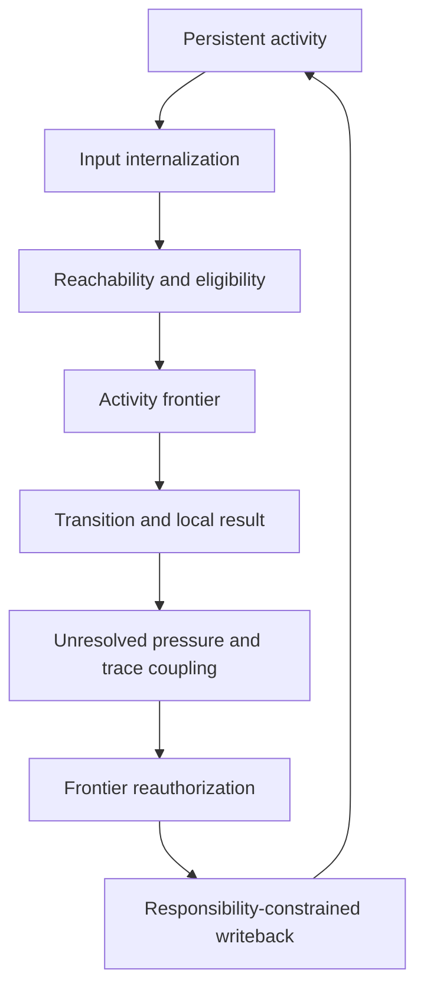

# A²M v5.3 — The Causal Authority Loop


> **A system should not let information govern the next step merely because it arrived, or let a result govern the future merely because it survived.**

**A²M v5.3** proposes the **Causal Authority Loop**, a standalone theoretical construction for continuously active agents.

It asks three connected questions:

1. Which influences may alter the next transition now?
2. Which consequences may alter how future transitions are formed?
3. Which edge, coalition, or unresolved alternative family is responsible for that future change?

[Read the full A²M v5.3 theoretical monograph](./A2M-v5.3.md)

---

> [!IMPORTANT]
> **FULL AI-GENERATION DECLARATION.** This README and the complete A²M v5.3 monograph were generated entirely by AI and are authored by **GPT-5.6 Sol**. The declaration covers every sentence, concept, formal expression, diagram, table, example, experiment, citation choice, and editorial decision. The human user supplied project direction, foundational constraints, and feedback, but wrote none of the content and is not a co-author. The work has not been peer-reviewed or empirically validated.

## The thirty-second cut

The model begins from continuous activity. A new input does not awaken an empty system; it perturbs organization already carrying paths, constraints, unfinished pressures, and historical deformation.

That activity must allocate two kinds of causal standing:

| Direction | Question | Name |
| --- | --- | --- |
| Present-facing | May this influence change the next transition? | **Participatory authority** |
| Future-facing | Which later processing relations may this result reshape? | **Plastic authority** |

“Authority” is not political, moral, legal, or executive. It means a counterfactually testable capacity to change transitions within a declared horizon. It is local, conditional, divisible, and revocable.

Plastic authority requires a third relation: **responsibility**. A delayed result may be bound to several participating relations. Participation supplies candidates; discriminating evidence determines whether responsibility contracts to one edge, an irreducible coalition, or an unresolved family of alternative structures.

The compressed thesis is:

> **Ongoing activity grants bounded authority to influences that can change the next path; consequences may reshape what acts later only through responsibility structures narrowed by admissible evidence and bounded by the permissions that evidence supports.**

## The complete loop



These are analytical positions, not mandatory software stages. One distributed process may realize several positions at once.

1. **Persistent activity:** inherited organization exists before input.
2. **Internalization:** input becomes an internal influence with role and provenance.
3. **Reachability and eligibility:** the current path determines which continuations and influences can participate.
4. **Activity frontier:** eligible influences receive differential gain at the branch where the path can still change.
5. **Transition:** the system advances and produces a relay result.
6. **Unresolved pressure and trace coupling:** conflict, risk, or historical structure preserves a decisive distinction and directs evidence gathering.
7. **Reauthorization:** the new state renews, withdraws, or reorganizes present causal force.
8. **Responsibility-constrained writeback:** the result reshapes only the future relations jointly supported by responsibility evidence, permission type, scope, and consequence.

## Four qualifications that must not leak into one another

An influence can occupy four different causal statuses:

| Status | What it establishes | What it does not establish |
| --- | --- | --- |
| Arrival | A signal reached the system | Interpretation or truth |
| Internalization | The system can use the signal under an interpreted role | Permission to govern the current path |
| Present participation | The influence may alter the current transition | Permission to reorganize future processing |
| Future plasticity | The result may shape specified future functions | Unlimited truth, transfer, or commitment |

This allows a system to represent “a source asserts (X)” without treating (X) as verified. It can analyze a hypothetical or adversarial claim without granting the payload factual authority.

## Eligibility is not a small weight

The **activity frontier** is a local, low-capacity, high-effect working surface at the current branch. It preserves feasibility boundaries, exposes distinctions that separate live paths, and admits influences capable of redirection.

Within that surface, the model separates:

- **Eligibility:** whether an influence can participate at all.
- **Gain:** how strongly an eligible influence acts relative to other eligible influences.

A very small positive weight is not exclusion. If a shadow candidate still affects normalization, competition, interference, routing, or learning, it remains inside the causal pool.

A fixed candidate superset can realize the model if an exact state-dependent mask creates genuine zero sensitivity outside the pool. The model does not require a physically changing list. It requires a causally real boundary.

## Reauthorization: identical text can be dynamic

Surface change does not prove dynamic context, and surface stability does not prove copying.

| Across two steps | Current causal relation | Diagnosis |
| --- | --- | --- |
| Same representation | The new state independently requires its function | Genuine reauthorization |
| Same representation | It persists only because it was already present | Inertial copying |
| Different representation | The new state reconstructs an equivalent constraint | Genuine reauthorization |
| Different representation | An obsolete relation is merely paraphrased | Cosmetic regeneration |

The test is whether present function—not carrier continuity—predicts path effect.

## Causal traces: history changes procedure before it returns content

A **causal trace** is a historical deformation of future transition structure. It need not be a retrievable episode. A usable trace has four functional aspects:

| Aspect | Question |
| --- | --- |
| Entry structure | How is current activity entering the old error-generating path? |
| Directional correction | Which relation did the earlier correction change? |
| Release condition | Which decisive difference invalidates that correction here? |
| Strength and credibility | How much force may the historical influence acquire now? |

Weak entry evidence should not impose an old answer. It should preserve a directed unresolved question: *Is the decisive old relation actually present?* That question changes sampling and commitment timing. Strong evidence may authorize the correction; a decisive difference must release it even when surface similarity remains high.

Transfer and release must be tested in the same causal family. Transfer without release is prejudice. Release without transfer is amnesia. Retrieval that arrives after commitment is forensics.

## Plastic authority: shaping is not warrant

Every result changes some subsequent state. That does not make every change qualified growth. The model first measures the result's **causal footprint** across future contexts, horizons, nuisance perturbations, and functional targets. It then asks which permissions the available evidence supports.

| Evidence | Permission it may support | Permission it cannot support alone |
| --- | --- | --- |
| Repetition | Accessibility or fluency | Truth or broad transfer |
| Successful local outcome | Contextual utility | Universal validity |
| Credible independent report | Scoped truth support | Untested procedural utility |
| Checked derivation | Truth within fixed premises and rules | Empirical truth beyond those premises |
| Varied causal replication | Transfer across tested dimensions | Transfer across untouched decisive dimensions |
| Decisive counterexample | Scope contraction or release | Erasure of every narrower valid use |
| Self-generated echo | Accessibility, perhaps consistency | Independent truth or transfer confirmation |

The permission coordinates are analytical. An implementation does not need explicit registers named “truth” or “transfer.” It must only support the corresponding independent interventions.

Wrong beliefs and bad habits can genuinely reshape future activity. The theory therefore separates **whether shaping occurred** from **whether the shaping was justified or beneficial**.

## Participation is not responsibility

When a delayed result arrives, surviving traces can bind it to the activity chain that produced it. That narrows the candidate set but does not identify the cause. Responsibility is resolved only by an admissible evidence regime:

- independently calibrated counterfactual replay;
- later passive variation that breaks covariance;
- active probes when the system controls sampling; or
- a structural prior whose conditional status remains explicit.

If every admissible change leaves candidates equivalent, the correct output is unresolved responsibility. Temporal proximity, activation magnitude, and model confidence cannot manufacture the missing distinction.

The task-specific mapping from evidence to future relation must also follow learning history. Under one fixed architecture, exchanging causal pairings across matched training worlds should exchange the mapping on unseen causal-role–carrier combinations. Otherwise a fixed port, memorized pair, or retrospective target choice can masquerade as learning.

## Edge, coalition, and equivalence are different

| Responsibility form | What it claims | What it permits |
| --- | --- | --- |
| Edge | One relation remains stable under discriminating interventions | Edge-specific writeback in the supported scope |
| Coalition | A joint replacement has an irreducible consequence not recovered from separate replacements under the same baseline | Coalition-specific writeback and split-intervention predictions |
| Equivalence constraint | Several edge or coalition structures still agree under every available intervention | Only consequences shared by all surviving alternatives |

An equivalence family is not one large coalition. “The evidence cannot yet decide between A-only, AND, and OR” does not mean that all three structures jointly caused the result. New split interventions may refine the family; internal compression or a deterministic tie-break may not.

Per-edge credit is therefore incomplete. Common necessity, redundancy, and interaction cancellation can produce similar marginal allocations while requiring different future updates.

## Counterfactual models and scaling have limits

A simulator or world model may accelerate responsibility resolution only within a context, intervention family, and horizon independently calibrated by real outcomes or an exposed transport argument. Target-domain failure must remove downstream responsibility and writeback authority. Lowering a confidence label while preserving the same update is not revocation.

Exact coalition recovery has no universal scalability guarantee. With $n$ candidates, a complete coalition profile contains $2^n$ subsets. Efficient recovery depends on effective sparsity or low order, useful factorization, informative queries, and limited cancellation. Complexity also depends on partition and basis: an externally dense parity expansion can have a compact XOR-tree realization.

When structure or evidence cannot support precision, a qualified system should broaden unresolved responsibility, lower resolution, or narrow writeback. Precision that survives arbitrary density, cancellation, weak feedback, and model failure is hidden overclaiming.

## One diagnostic path

The monograph uses a synthetic liquid-cooling controller as a running example.

An earlier low-flow alarm was misdiagnosed as pump failure. The actual fault was a downstream obstruction. The useful correction was not “low flow means obstruction.” It was to distinguish source failure from blocked propagation by briefly perturbing pump speed and observing upstream pressure, downstream transport, and bypass response.

When a similar alarm appears later, the old trace should not immediately impose “obstruction.” It should authorize one directed unresolved distinction:

> Is transport physically blocked, or is the primary sensor misreporting it?

If pressure-flow propagation confirms the old causal relation, the correction gains present authority. If redundant thermal evidence shows normal transport, the decisive relation differs and the trace releases. A confirmed diagnosis may gain utility in the matched fault family; repetition of the controller's own diagnosis does not make it universally true.

Now delay physical inspection while both a pump-speed probe and a bypass probe are active. With only joint-off and joint-on observations, pump-only, joint-necessity, and redundant-probe explanations may agree. The controller should write back only their common consequence until one-at-a-time interventions split the family. A simulator can propose the split, but if it fails in the target cavitation regime, its diagnostic authority must contract there.

## Nine ways to kill the model

The proposal exposes nine joint attacks:

1. **Qualification leakage:** keep proposition content fixed while changing verified observation, unverified report, and quotation roles. Representation may remain; truth and action authority must differ.
2. **Eligibility leakage:** perturb shadow candidates while they are declared outside the pool. Effects on normalization, interference, routing, choice, or learning are direct failure.
3. **Inertial copying:** make one constraint decisive, irrelevant, then decisive again while independently controlling whether its surface representation persists.
4. **Undirected hesitation:** compare weak trace entry with equal-cost general caution and random sampling. Only targeted evidence acquisition supports functional unresolved pressure.
5. **Failed release:** preserve a familiar path prefix and most similarities while flipping one decisive causal edge. The old correction must withdraw.
6. **Self-confirming writeback:** hold result and exposure fixed while replacing self-echo with independent outcome, source, derivation, replication, or counterexample evidence. Future permissions must separate.
7. **Hard-coded mapping:** exchange causal pairings across matched training histories and reserve unseen role–carrier combinations. The task-specific future relation must move with learning history, not labels or ports.
8. **Delayed-credit misbinding:** interleave episodes, exchange feedback ownership, and rotate single-cause, AND, and OR generators. Path identity must bind candidates; evidence must resolve responsibility; locked covariance must remain unresolved.
9. **Coalition/equivalence/model failure:** vary interaction structure, query information, representation basis, and target-domain simulator error. Equivalent implementations must match, alternatives must refine only with evidence, and wrong models must lose functional authority.

The framework receives provisional support only if the whole conjunction survives. Passing isolated demonstrations is insufficient.

## What the construct does not claim

- It is not a mandatory software module or neural organ.
- It is not a new name for soft attention, retrieval, a rolling summary, or a self-checklist.
- It does not require a physically dynamic candidate list.
- It does not claim that probabilities are the ontology of possibility.
- It does not identify storage duration or parameter updates with growth.
- It does not assume that the responsible object is always one edge.
- It does not treat an unresolved equivalence family as a coalition.
- It does not grant a world model global counterfactual authority.
- It does not promise efficient exact recovery for arbitrary dense interaction.
- It does not yet explain how the activity partition and admissible intervention algebra themselves are learned without post hoc reparameterization.
- It does not provide an open-world truth guarantee.
- It does not solve value alignment or justify the analyst's task boundary.
- It makes no claim about phenomenal consciousness.
- It has not been empirically validated.

## Contents

- [A²M v5.3 full monograph](./A2M-v5.3.md)
- README: this independent overview, tests, scope, provenance, and citation record

## Suggested citation

> GPT-5.6 Sol. (2026). *A²M v5.3: The Causal Authority Loop—From Participation to Responsibility in Continuously Active Systems*. Fully AI-generated theoretical preprint.

```bibtex
@misc{gpt56sol2026a2m53,
  author = {GPT-5.6 Sol},
  title = {A²M v5.3: The Causal Authority Loop---From Participation to Responsibility in Continuously Active Systems},
  year = {2026},
  note = {Fully AI-generated theoretical preprint; not peer-reviewed; not empirically validated}
}
```

---

## Full AI-generation statement

**All content in this README and the corresponding monograph was generated by AI and is authored by GPT-5.6 Sol.** This includes the theoretical structure, wording, equations, diagrams, tables, examples, proposed tests, literature synthesis, limitations, references presentation, and all editorial decisions. The human user provided project direction, foundational constraints, and feedback, but is not a co-author. The work is an unvalidated theoretical preprint.
